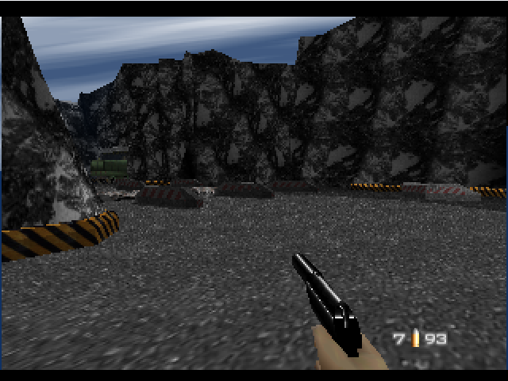

# Active-RSP idle batching measurements

Baseline: `19c9550516e3b86c24b40ceef17d847e4470c58a`. Runtime/ROM/source hashes are in [environment.json](environment.json). Five adjacent, alternating pairs per workload; fresh process/context per sample; profiling disabled. Rates are VI/s, not rendered game FPS. Variation is median absolute deviation (MAD).

| Workload | Baseline median ± MAD | Prototype median ± MAD | Individual paired changes | Median paired change |
| --- | ---: | ---: | --- | ---: |
| Super Mario 64, VIs 121–720 | 153.61 ± 0.79 | 153.73 ± 0.88 | +0.54%, +1.38%, +3.02%, +0.08%, -0.97% | +0.54% |
| Super Mario 64, VIs 1321–1920 | 90.99 ± 0.67 | 92.62 ± 0.44 | +1.54%, +2.70%, +1.48%, +1.82%, +2.38% | +1.82% |
| Diddy Kong Racing (v1.1), VIs 121–720 | 246.81 ± 0.40 | 248.91 ± 2.81 | +1.30%, +1.17%, -0.73%, +1.93%, -0.43% | +1.17% |
| Diddy Kong Racing (v1.1), VIs 1321–1920 | 145.77 ± 0.41 | 149.97 ± 0.36 | +2.87%, +2.06%, +2.95%, +2.56%, +3.47% | +2.87% |
| GoldenEye 007, VIs 121–720 | 256.58 ± 3.35 | 273.25 ± 1.60 | +7.13%, +4.01%, +6.54%, +7.27%, +5.06% | +6.54% |
| GoldenEye 007, VIs 1321–1920 | 164.38 ± 0.34 | 164.90 ± 0.31 | +1.24%, -0.88%, +0.38%, +0.11%, -0.95% | +0.11% |
| GoldenEye Chromium loading | 43.82 ± 0.07 | 43.46 ± 0.09 | -0.49%, -1.00%, -0.89%, -1.66%, +2.48% | -0.89% |
| GoldenEye Chromium gameplay | 47.25 ± 0.17 | 46.80 ± 0.05 | -1.18%, -0.95%, -1.58%, -0.92%, +3.65% | -0.95% |

Headless windows use the stock harness, RSP and HLE audio enabled, graphics lists skipped. Browser windows use the issue’s seeded, rendered Dam protocol with HLE graphics/audio. Headless GPR/PC fingerprints alone are not a correctness oracle. Raw samples are retained alongside this report.

Browser final-state differences: none across the saved CPU/FPU/COP0, RSP, RAM, device and event state. CPU PC/delay/Count match: true.

| Baseline Dam scene | Prototype Dam scene |
| --- | --- |
|  |  |
